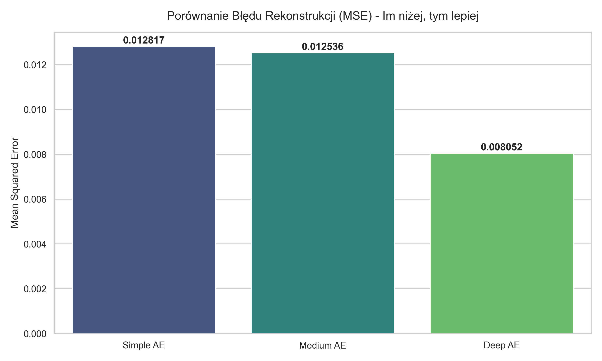
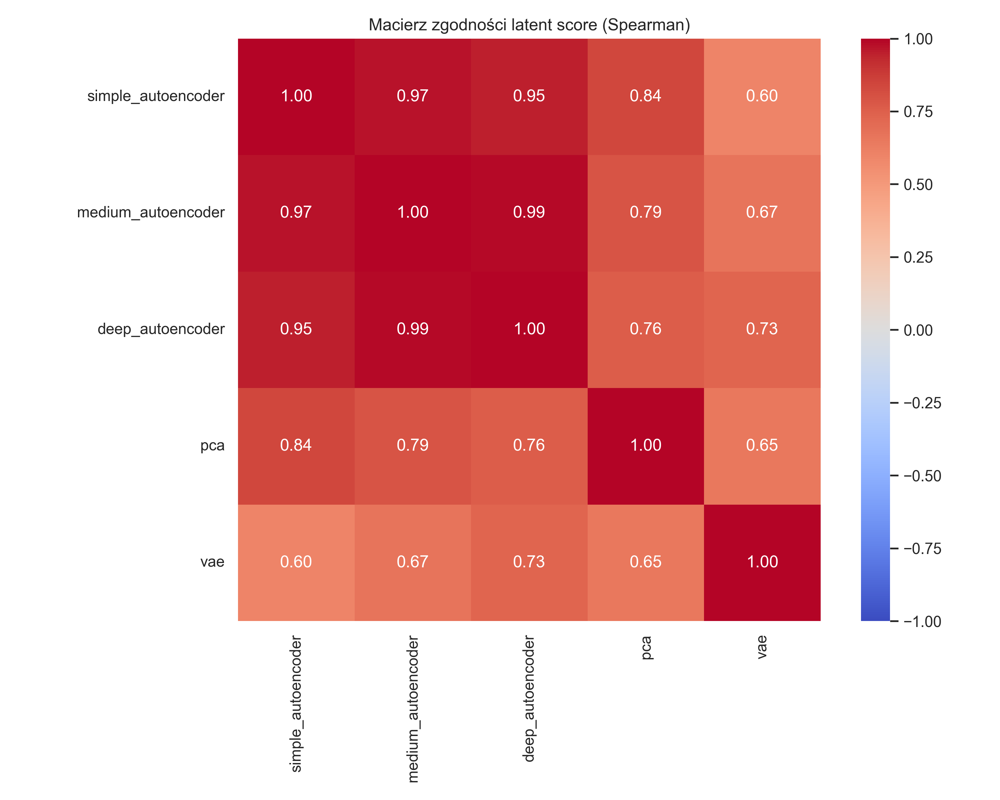
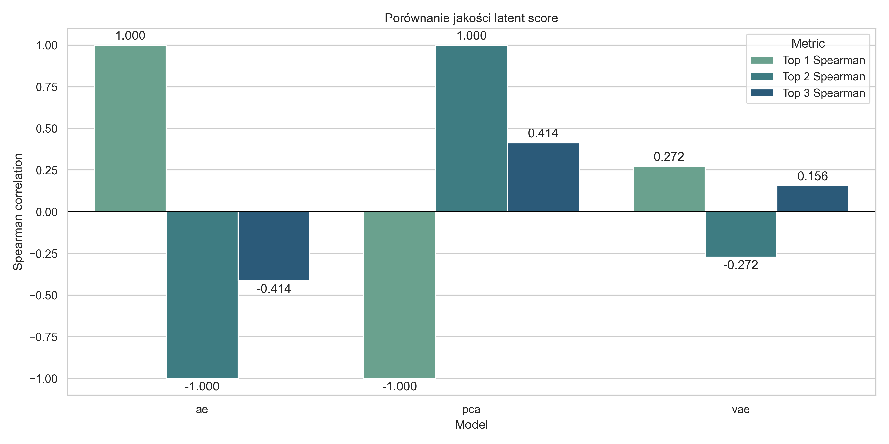
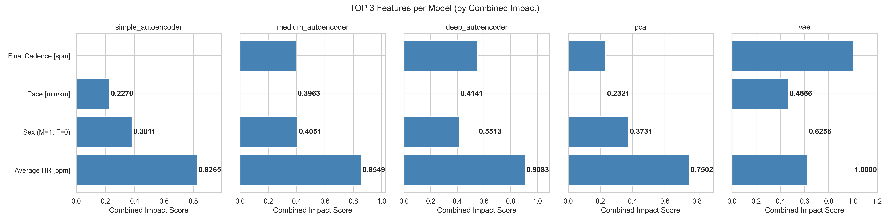

# ARCHITEKTURY AUTOENKODERÓW W OCENIE WYDAJNOŚCI SPORTOWEJ: KOMPRESJA DANYCH I RANKING ZAWODNIKÓW

**Mateusz Kubita**, **Jan Zubalewicz** | Politechnika Warszawska  
**14 marca 2026**

---

## Streszczenie

Szybki rozwój technologii ubieralnych (wearables) i sensorów sportowych ułatwił gromadzenie potężnych zbiorów danych o aktywności fizycznej. Wyzwaniem pozostaje jednak synteza tych wielowymiarowych informacji w jeden czytelny wskaźnik. W niniejszej pracy prezentujemy oparte na danych (data-driven) podejście do oceny wydajności biegowej, wykorzystujące nienadzorowane metody uczenia maszynowego do redukcji wymiarowości i generowania syntetycznego wskaźnika formy (*Performance Score*). Przeanalizowaliśmy pięć różnych architektur. Otrzymane wyniki błędu rekonstrukcji (MSE) pokazują, że choć klasyczna redukcja liniowa (PCA) wychwytuje główną część wariancji, to zaawansowane modele nieliniowe – w szczególności **Variational Autoencoder (VAE)** (MSE = **0.002813**) i **Deep Autoencoder** (MSE = **0.003822**) – oferują znacznie głębszy wgląd w złożone interakcje biomechaniczne i fizjologiczne. Wdrożenie autorskiej metryki *Combined Impact* pozwoliło ponadto na interpretację decyzji modeli, precyzyjnie definiując parametry odróżniające liderów od outsiderów.

---

## 1. Wprowadzenie i Cel Projektu

Współczesne monitorowanie wysiłku fizycznego opiera się na ciągłym pomiarze wielu zmiennych jednocześnie, takich jak tętno, tempo, kadencja czy pokonywane przewyższenia. Tradycyjne metody oceny jakości treningu często wykorzystują arbitralnie dobrane wagi dla poszczególnych parametrów. Takie uproszczone podejście może jednak prowadzić do pominięcia złożonych, nieliniowych zależności zachodzących w organizmie sportowca.

**Głównym celem projektu** było stworzenie w pełni obiektywnego systemu oceny wydajności. Zamiast z góry zakładać, które metryki są najważniejsze, zastosowaliśmy algorytmy redukcji wymiarowości w celu bezstratnej kompresji wielowymiarowego profilu zawodnika do pojedynczej wartości (ukrytej warstwy autoenkodera). Powstały w ten sposób *Performance Score* nie tylko pozwala na sprawiedliwe pozycjonowanie sportowców w rankingu, ale także – dzięki dedykowanym technikom interpretowalności (XAI) – wskazuje, które parametry treningowe faktycznie determinują osiągany rezultat.

---

## 2. Metodologia

### 2.1. Zbiór danych i Preprocessing

Badania przeprowadzono na zbiorze **GoldenCheetah OpenData**, który gromadzi zanonimizowane dane treningowe udostępniane przez samych sportowców. Baza ta obejmuje ponad 1300 użytkowników i przeszło 700 000 zarejestrowanych aktywności. Ponieważ dane crowdsourcingowe charakteryzują się istotną wariancją jakości oraz dużą liczbą braków, niezbędne było wdrożenie rygorystycznego procesu przygotowania danych (preprocessing):

1. **Filtrowanie danych:** Usunięto rekordy niezawierające kluczowych parametrów wysiłkowych, m.in. tętna średniego, kadencji końcowej czy dystansu.
2. **Inżynieria cech (Feature Engineering):** Średnią prędkość przekształcono na powszechnie stosowane w sportach wytrzymałościowych tempo (min/km). Na podstawie daty treningu i roku urodzenia wyliczono dokładny wiek zawodnika w momencie pomiaru.
3. **Imputacja braków:** Puste wartości dla przewyższeń zastąpiono zerem (zakładając ukształtowanie płaskie), natomiast braki w rozprzężeniu tlenowym wypełniono medianą, aby zminimalizować wpływ na rozkład statystyczny cechy.
4. **Normalizacja:** Po wyeliminowaniu redundantnych zmiennych kategorycznych, ostateczny zbiór ponad miliona próbek poddano standaryzacji algorytmem *MinMaxScaler*.

### 2.2. Wykorzystane Architektury

W celu rzetelnej oceny skuteczności proponowanej metody, zaimplementowano i przetestowano pięć podejść architektonicznych:

* **PCA (Principal Component Analysis):** Klasyczna transformacja liniowa, stanowiąca punkt odniesienia (baseline).
* **Simple AE:** Jednowarstwowy autoenkoder o najprostszej topologii (Input -> 1 -> Output).
* **Medium AE:** Sieć wyposażona w dodatkowe warstwy ukryte (4 neurony) przed wąskim gardłem.
* **Deep AE:** Wielowarstwowa struktura (Input -> 5 -> 3 -> 1 -> 3 -> 5 -> Output), zoptymalizowana pod kątem ekstrakcji cech hierarchicznych.
* **VAE (Variational Autoencoder):** Architektura probabilistyczna mapująca przestrzeń danych na ciągły rozkład statystyczny, z optymalizacją dywergencji Kullbacka-Leiblera (KL).

### 2.3. Interpretowalność Modelu (Combined Impact)

Samo wygenerowanie *Performance Score* nie wyjaśnia bezpośrednio, które biomechaniczne lub fizjologiczne parametry przesądziły o przypisanej ocenie, czyniąc model trudną do zinterpretowania "czarną skrzynką" (black-box). Aby zidentyfikować metryki o najwyższym znaczeniu, opracowano autorską, uśrednioną miarę wpływu cechy – **Combined Impact**.

Pojedyncze metody oceny istotności cech mają swoje ograniczenia (np. niektóre wykrywają tylko zależności liniowe, inne są wrażliwe na szum). Metryka *Combined Impact* rozwiązuje ten problem poprzez syntezę czterech fundamentalnie różnych estymatorów. Wartość dla każdej cechy jest liczona ze wzoru:

$Combined\_Impact = \frac{Spearman_{norm} + Kendall_{norm} + MI_{norm} + Permutation_{norm}}{4}$

Każdy z czterech komponentów wnosi inną, unikalną perspektywę na relację między daną cechą wejściową a ostatecznym wynikiem z autoenkodera:

1. **Korelacja Rang Spearmana ($Spearman_{norm}$):** Identyfikuje relacje monotoniczne. Wykrywa sytuacje, w których wzrost/spadek danej cechy (np. tempa) konsekwentnie wiąże się ze wzrostem/spadkiem wyniku wydajnościowego. Metoda jest jednak ograniczona w przypadku silnie nieliniowych relacji.
2. **Korelacja Tau Kendalla ($Kendall_{norm}$):** Podobnie jak współczynnik Spearmana, opiera się na rangach, jednak jest znacznie bardziej odporna na wartości odstające (outliery). Zapewnia to stabilność oceny w zbiorach danych z sensorów IoT, które często są zaszumione.
3. **Wzajemna Informacja ($MI_{norm}$ - Mutual Information Regression):** Metoda oparta na teorii informacji (entropii). Jest w stanie uchwycić dowolne, nawet najbardziej skomplikowane i ściśle nieliniowe relacje pomiędzy cechą a *Performance Score*, których nie wykryłyby klasyczne korelacje (np. sytuacja, w której zarówno zbyt niskie, jak i zbyt wysokie tętno oznacza niższy wynik, a optymalny jest środek przedziału).
4. **Ważność Permutacji ($Permutation_{norm}$ - Permutation Importance):** Weryfikacja predykcyjna. Wykorzystując model pomocniczy (Random Forest), badamy o ile wzrośnie błąd predykcyjny wyniku, jeżeli w sposób losowy zaburzymy wartości badanej cechy. Jeśli cecha jest kluczowa dla przewidywania *Performance Score*, jej przemieszanie drastycznie obniży jakość modelu.

Każda z tych wartości, przed zsumowaniem, jest normalizowana ($X_{norm}$) przez podzielenie jej przez maksymalną wartość odnotowaną dla danej metody (skalowanie Min-Max do zakresu 0-1). Dzięki temu, średnia tych czterech miar (*Combined Impact*) dostarcza niezwykle wyważonego i odpornego na odchylenia rankingu najważniejszych parametrów decydujących o sukcesie sportowym.

---

## 3. Wyniki i Dyskusja

### 3.1. Błąd Rekonstrukcji (MSE)

Kluczowym kryterium oceny było sprawdzenie, na ile bezstratnie każdy z modeli potrafi zakodować i odtworzyć profil sportowca na podstawie pojedynczego wskaźnika wydajności.

| Model | Architektura | MSE | Obserwacje |
| :--- | :--- | :--- | :--- |
| **pca** | Input -> PCA(1) -> Output | **0.001150** | Najniższy błąd całkowity; wysoki udział wariancji liniowej. |
| **simple_autoencoder** | Input -> 1 -> Output | **0.051031** | Podstawowy model nieliniowy charakteryzujący się wysoką utratą detali. |
| **medium_autoencoder** | Input -> 4 -> 1 -> 4 -> Output | **0.005125** | Znacząca poprawa jakości kompresji względem prostej sieci. |
| **vae** | Input -> Dense -> z_mean(1) -> Output | **0.002813** | Wysoka stabilność przestrzeni ukrytej dzięki dystrybucji probabilistycznej. |
| **deep_autoencoder** | Input -> 5 -> 3 -> 1 -> 3 -> 5 -> Output | **0.003822** | Skuteczna kompresja i modelowanie złożonych relacji nieliniowych. |

Wyniki wskazują, że klasyczna metoda PCA bardzo dobrze radzi sobie z uchwyceniem ogólnej (liniowej) wariancji w danych (MSE = 0.001150). Pomimo to, głębokie architektury nieliniowe (VAE i Deep AE) osiągają wysoce satysfakcjonujący błąd na poziomie setnych części procenta, oferując jednocześnie elastyczniejszą i pełniejszą przestrzeń ukrytą (Latent Space) niezbędną do zaawansowanego profilowania zawodników.

  
*Rysunek 1: Zestawienie wartości błędu średniokwadratowego (MSE) dla analizowanych modeli.*

### 3.2. Spójność Metod i Reprezentacja Ukryta

Przeprowadzona eksploracja ujawniła, w jakim stopniu badane modele zgadzają się ze sobą w kontekście przypisywania ostatecznych ocen zawodnikom.

  
*Rysunek 2: Macierz korelacji wyników (Model Agreement), obrazująca spójność poszczególnych architektur.*

  
*Rysunek 3: Dystrybucja i charakterystyka wyników wewnątrz warstw ukrytych poszczególnych modeli.*

### 3.3. Interpretacja kluczowych cech (TOP 3 Features)

Wykres najważniejszych cech dostarcza kluczowych informacji na temat tego, jak poszczególne parametry treningowe wpływają na generowany przez modele wskaźnik formy. Analiza pozwala sformułować istotne wnioski:

* **Zgodność między modelami:** Niezależnie od stopnia złożoności architektury (od liniowego PCA do probabilistycznego VAE), wszystkie modele wykazują niemal identyczny ranking trzech najważniejszych cech. Sugeruje to, że wybrane parametry są uniwersalnymi, silnymi markerami wydajności w badanym zbiorze danych.
* **Hierarchia ważności parametrów:**
    1.  **Średnie tętno (`Average HR [bpm]`):** Jest absolutnie dominującym parametrem (wyniki na poziomie 0.75 do 1.0). Potwierdza to fizjologiczną zasadę, że tętno, jako bezpośrednia miara obciążenia układu krążenia, jest najsilniejszym indykatorem formy biegacza.
    2.  **Płeć zawodnika (`Sex (M=1, F=0)`):** Drugie miejsce sugeruje istnienie wyraźnych, statystycznie istotnych różnic w profilach wydajnościowych między kobietami a mężczyznami.
    3.  **Tempo biegu (`Pace [min/km]`):** Trzecia najważniejsza cecha. Jako miara prędkości, tempo jest logicznym i mocnym markerem wydajności.
* **Lokalne różnice w profilach:** Choć ranking się pokrywa, siła wpływów różni się między modelami. Model VAE przypisuje tętnu maksymalne znaczenie (1.0000), najsilniej oddzielając go od pozostałych. PCA wykazuje bardziej zrównoważone wyniki dla płci i tempa. 

  
*Rysunek 4: Najistotniejsze parametry determinujące ocenę wydajności, obliczone z wykorzystaniem metryki Combined Impact dla każdej architektury.*

---

## 4. Wnioski

Przeprowadzone eksperymenty dowodzą, że metody nienadzorowanego uczenia maszynowego stanowią potężne narzędzie do obiektywizacji oceny parametrów sportowych. Podejście to skutecznie eliminuje problem doboru arbitralnych wag w systemach monitorujących obciążenia treningowe.

Chociaż analiza składowych głównych (PCA) osiągnęła najniższy poziom błędu rekonstrukcji, modele takie jak VAE i Deep Autoencoder charakteryzują się większym potencjałem w mapowaniu nieliniowych, fizjologicznych zależności występujących w skomplikowanych jednostkach treningowych. Kluczowym osiągnięciem pracy jest wprowadzenie autorskiej miary *Combined Impact*, która mityguje problem nieprzejrzystości sztucznych sieci neuronowych. Wzbogacenie czystego wyniku o ranking najistotniejszych metryk dostarcza analitykom sportowym wymiernych i czytelnych informacji, tworząc solidne podwaliny pod zautomatyzowane systemy detekcji talentów i ewaluacji skuteczności cykli treningowych.